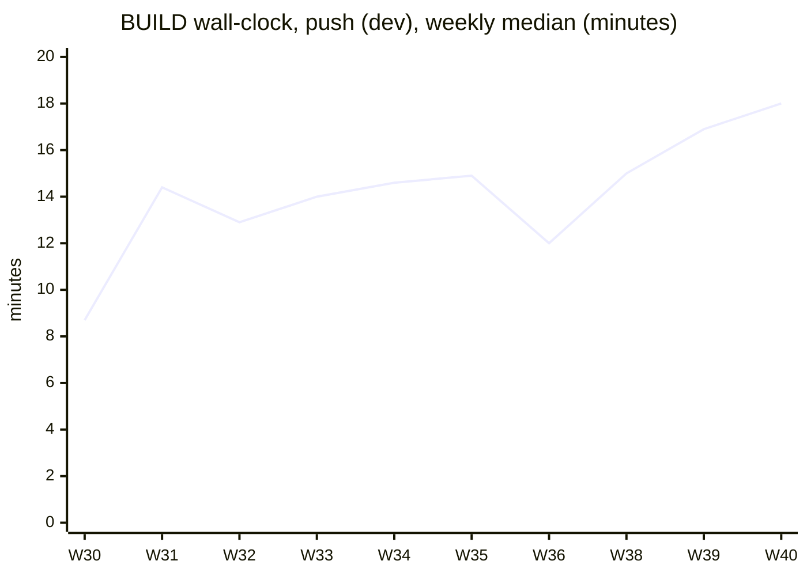
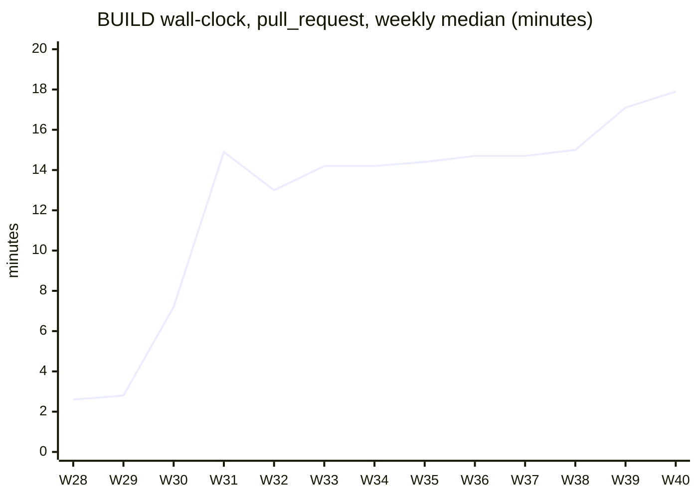

# CI timings

Generated by `.github/ci-metrics/report.py` from the job records in `.github/ci-metrics/data/`. Do not edit by hand; it is regenerated after every collector run.

- Data: 11,822 job records from 2026-07-03 to 2026-09-30.
- Current window: the 14 days up to 2026-09-30 10:42 UTC (from 2026-09-16 10:42). Previous window: the 14 days before it.
- `push (dev)` runs are compared apart from `pull_request` runs: they read different cache scopes (pull requests can read `dev`'s caches, `dev` pushes cannot read caches created on pull request branches).
- Durations are the time a job ran; queue time (waiting for a runner) is shown separately. Medians and p90 (90th percentile) are over the jobs in the window.

## Regressions

A median that rose by more than 20% and at least 30 seconds against the previous window, with at least 5 samples in both windows.

- Performance Gate (whole run), pull_request: median 1m 50s to 2m 48s (+53%, 132 runs)
- BUILD / mpi-build, pull_request: median 4m 19s to 5m 25s (+25%, 134 runs)
- Performance Gate / perf-regression, pull_request: median 1m 47s to 2m 40s (+50%, 132 runs)

## Wall-clock per workflow (critical path)

Time from the first job of a run being created to the last job finishing (includes queue time and job dependencies such as `changes` before `build`). Only first-attempt runs whose jobs all succeeded and in which at least one real job ran (see Exclusions). "Usually last" is the job that finished last most often, i.e. the job a pull request waits for.

| Workflow | Event | Runs | Median | p90 | Previous median | Change | Usually last |
| --- | --- | --- | --- | --- | --- | --- | --- |
| BUILD | pull_request | 125 | 16m 57s | 19m 56s | 14m 44s | +15% | ci-build-gate (100%) |
| BUILD | push (dev) | 67 | 16m 02s | 18m 43s | 14m 55s | +7% | ci-build-gate (100%) |
| Changelog Fragment Check | pull_request | 180 | 14s | 38s | 15s | -7% | check-changelog-fragment (100%) |
| Check PR Has Linked Issue | pull_request | 167 | 8s | 22s | 7s | +14% | check-linked-issue (100%) |
| Clang Format Check | pull_request | 183 | 36s | 2m 27s | 36s | +0% | clang-format-gate (100%) |
| DevOps C++ Check | pull_request | 125 | 2m 35s | 9m 22s | - | n/a | cpp-check-gate (100%) |
| Dismiss Stale Approvals | pull_request | 127 | 15s | 51s | 16s | -6% | dismiss-stale-approvals (100%) |
| Docs | pull_request | 128 | 5m 56s | 6m 18s | - | n/a | validate (99%) |
| LINT | pull_request | 129 | 11m 04s | 15m 02s | 13m 02s | -15% | lint-gate (100%) |
| LINT | push (dev) | 68 | 9m 50s | 15m 05s | 13m 46s | -29% | lint-gate (100%) |
| License Header Check | pull_request | 140 | 29s | 2m 05s | 27s | +7% | license-check-gate (100%) |
| Performance Gate | pull_request | 132 | 2m 48s | 3m 57s | 1m 50s | +53% **regression** | perf-regression (100%) |

## Trend

Weekly median wall-clock of BUILD runs; weeks with fewer than 3 runs are omitted.





## Jobs

Jobs with no run in the current window are omitted. "Previous median" is n/a with fewer than 5 samples in either window.

### BUILD

| Job | Event | Runs | Median | p90 | Previous median | Change | Queue median | Queue p90 |
| --- | --- | --- | --- | --- | --- | --- | --- | --- |
| benchmark | pull_request | 154 | 1m 27s | 1m 37s | 1m 16s | +14% | 3s | 1m 19s |
| benchmark | push (dev) | 68 | 1m 26s | 1m 37s | 1m 20s | +9% | 3s | 5s |
| build (ubuntu-24.04, Debug) | pull_request | 134 | 9m 02s | 10m 19s | 7m 58s | +13% | 3s | 1m 54s |
| build (ubuntu-24.04, Debug) | push (dev) | 67 | 9m 09s | 10m 11s | 8m 11s | +12% | 3s | 9s |
| build (ubuntu-24.04, Release) | pull_request | 134 | 10m 10s | 11m 40s | 9m 16s | +10% | 3s | 1m 40s |
| build (ubuntu-24.04, Release) | push (dev) | 67 | 10m 26s | 11m 33s | 10m 14s | +2% | 3s | 9s |
| build (ubuntu-24.04-arm, Debug) | pull_request | 134 | 6m 06s | 6m 56s | 5m 40s | +8% | 5s | 26s |
| build (ubuntu-24.04-arm, Debug) | push (dev) | 67 | 6m 10s | 7m 03s | 5m 56s | +4% | 5s | 7s |
| build (ubuntu-24.04-arm, Release) | pull_request | 134 | 7m 46s | 8m 36s | 7m 02s | +10% | 5s | 56s |
| build (ubuntu-24.04-arm, Release) | push (dev) | 67 | 7m 49s | 8m 44s | 7m 18s | +7% | 5s | 6s |
| build-static-lto | pull_request | 138 | 16m 22s | 17m 46s | 14m 22s | +14% | 3s | 56s |
| build-static-lto | push (dev) | 68 | 15m 01s | 17m 59s | 14m 30s | +4% | 3s | 4s |
| changes | pull_request | 192 | 7s | 9s | 8s | -12% | 3s | 7s |
| changes | push (dev) | 68 | 13s | 16s | 12s | +8% | 3s | 3s |
| ci-build-gate | pull_request | 158 | 3s | 4s | 3s | +0% | 3s | 4s |
| ci-build-gate | push (dev) | 67 | 3s | 4s | 3s | +0% | 3s | 11s |
| mpi-build | pull_request | 134 | 5m 25s | 7m 08s | 4m 19s | +25% **regression** | 3s | 59s |
| mpi-build | push (dev) | 68 | 5m 32s | 6m 47s | 4m 48s | +15% | 3s | 23s |

### Changelog Fragment Check

| Job | Event | Runs | Median | p90 | Previous median | Change | Queue median | Queue p90 |
| --- | --- | --- | --- | --- | --- | --- | --- | --- |
| check-changelog-fragment | pull_request | 180 | 11s | 14s | 12s | -8% | 3s | 7s |

### Check PR Has Linked Issue

| Job | Event | Runs | Median | p90 | Previous median | Change | Queue median | Queue p90 |
| --- | --- | --- | --- | --- | --- | --- | --- | --- |
| check-linked-issue | pull_request | 167 | 5s | 6s | 4s | +25% | 3s | 13s |

### Clang Format Check

| Job | Event | Runs | Median | p90 | Previous median | Change | Queue median | Queue p90 |
| --- | --- | --- | --- | --- | --- | --- | --- | --- |
| Check Changed C++ Files Formatting | pull_request | 171 | 14s | 19s | - | n/a | 3s | 18s |
| Check Changed C++ Formatting | pull_request | 12 | 13s | 22s | 16s | -19% | 3s | 4s |
| changes | pull_request | 192 | 7s | 9s | 7s | +0% | 3s | 14s |
| clang-format-gate | pull_request | 183 | 3s | 4s | 3s | +0% | 3s | 1m 08s |

### DevOps C++ Check

| Job | Event | Runs | Median | p90 | Previous median | Change | Queue median | Queue p90 |
| --- | --- | --- | --- | --- | --- | --- | --- | --- |
| Run DevOps C++ Checks | pull_request | 125 | 1m 56s | 7m 04s | - | n/a | 3s | 16s |
| changes | pull_request | 143 | 7s | 9s | - | n/a | 3s | 15s |
| cpp-check-gate | pull_request | 128 | 3s | 4s | - | n/a | 3s | 24s |

### Dismiss Stale Approvals

| Job | Event | Runs | Median | p90 | Previous median | Change | Queue median | Queue p90 |
| --- | --- | --- | --- | --- | --- | --- | --- | --- |
| dismiss-stale-approvals | pull_request | 127 | 12s | 15s | 12s | +0% | 3s | 28s |

### Docs

| Job | Event | Runs | Median | p90 | Previous median | Change | Queue median | Queue p90 |
| --- | --- | --- | --- | --- | --- | --- | --- | --- |
| build | pull_request | 1 | 37s | 37s | - | n/a | 3s | 3s |
| validate | pull_request | 127 | 5m 53s | 6m 11s | - | n/a | 3s | 5s |

### LINT

| Job | Event | Runs | Median | p90 | Previous median | Change | Queue median | Queue p90 |
| --- | --- | --- | --- | --- | --- | --- | --- | --- |
| changes | pull_request | 191 | 7s | 9s | 7s | +0% | 3s | 10s |
| changes | push (dev) | 68 | 13s | 15s | 14s | -4% | 3s | 4s |
| lint | pull_request | 129 | 9m 17s | 14m 27s | 12m 44s | -27% | 3s | 57s |
| lint | push (dev) | 68 | 9m 19s | 14m 30s | 13m 20s | -30% | 3s | 7s |
| lint-gate | pull_request | 161 | 3s | 4s | 3s | +0% | 3s | 8s |
| lint-gate | push (dev) | 68 | 3s | 4s | 2s | +50% | 3s | 4s |

### License Header Check

| Job | Event | Runs | Median | p90 | Previous median | Change | Queue median | Queue p90 |
| --- | --- | --- | --- | --- | --- | --- | --- | --- |
| Check License Headers | pull_request | 140 | 8s | 9s | 7s | +14% | 3s | 16s |
| changes | pull_request | 192 | 7s | 9s | 8s | -12% | 3s | 6s |
| license-check-gate | pull_request | 182 | 3s | 4s | 3s | +0% | 3s | 58s |

### Performance Gate

| Job | Event | Runs | Median | p90 | Previous median | Change | Queue median | Queue p90 |
| --- | --- | --- | --- | --- | --- | --- | --- | --- |
| perf-regression | pull_request | 132 | 2m 40s | 3m 50s | 1m 47s | +50% **regression** | 3s | 23s |

## Build analysis

No build analysis records yet. They come from the `build-timings-*` artifacts of `BUILD` and `LINT` runs, which the collector ingests from the day those jobs started uploading them (nothing can be backfilled).

## Eigen cache hit rate

Share of jobs that restored the Eigen source from the cache instead of cloning it from GitLab (only jobs that have the `Cache Eigen source` step; see `eigen_cache_hit` in SCHEMA.md). Weeks are ISO weeks of the job's creation.

| Week | push (dev), hit rate (jobs) | pull_request, hit rate (jobs) | All, hit rate (jobs) |
| --- | --- | --- | --- |
| 2026-W40 | 83% (48) | 77% (44) | 80% (92) |

```mermaid
xychart-beta
    title "Eigen cache hit rate, all events, weekly (%)"
    x-axis ["W40"]
    y-axis "percent" 0 --> 100
    line [80]
```

## Exclusions

Left out of the medians, p90 and the trend (each job counted once, under the first matching reason):

| Reason | Jobs |
| --- | --- |
| cancelled | 309 |
| event other than push or pull_request | 121 |
| failed or other non-success conclusion | 767 |
| infrastructure failure | 4 |
| push to a branch other than dev | 64 |
| rerun (attempt > 1) | 67 |

Kept: 10,490 of 11,822 jobs. Jobs the collector skipped (`skipped` conclusion) were never recorded.

Whole-run wall-clock additionally leaves out these runs (counted once each):

| Reason | Runs |
| --- | --- |
| run where the paths filter skipped every real job | 116 |
| run with a non-successful job | 493 |

The wall-clock figures cover 3,781 runs. A run where only `changes` and `*-gate` jobs ran is one in which the paths filter skipped all real jobs (for example a pull request without C++ changes).
