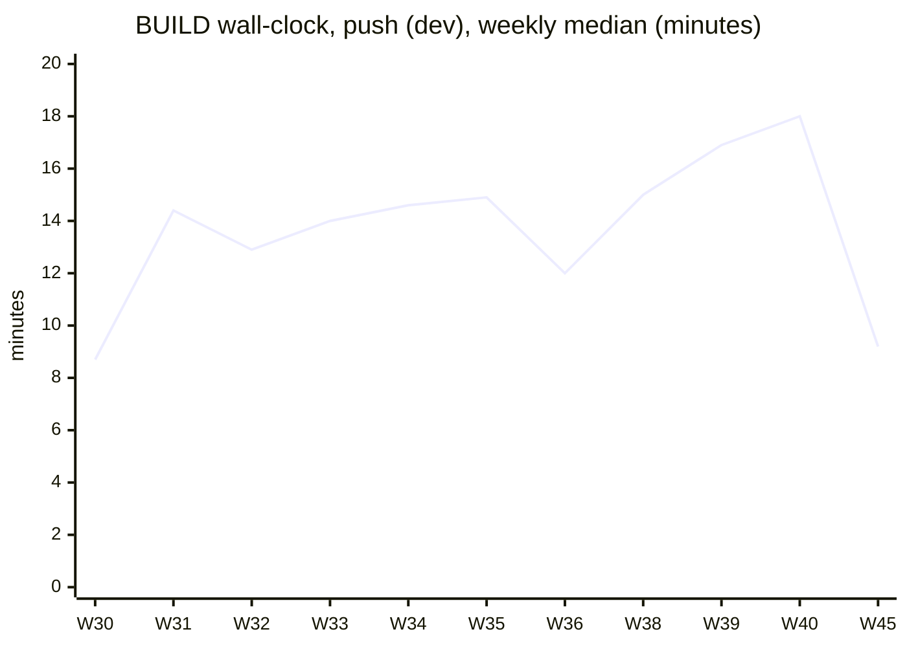
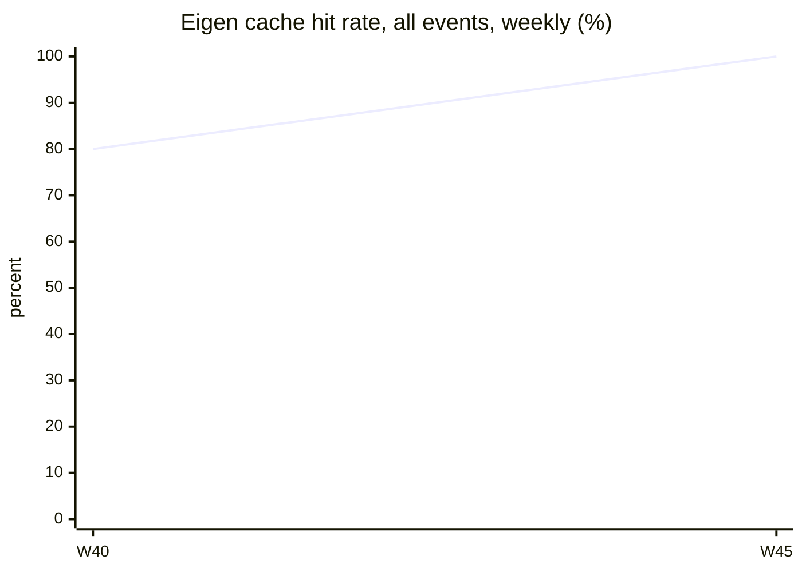

# CI timings

Generated by `.github/ci-metrics/report.py` from the job records in `.github/ci-metrics/data/`. Do not edit by hand; it is regenerated after every collector run.

- Data: 13,485 job records from 2026-07-03 to 2026-11-06.
- Current window: the 14 days up to 2026-11-06 12:08 UTC (from 2026-10-23 12:08). Previous window: the 14 days before it.
- `push (dev)` runs are compared apart from `pull_request` runs: they read different cache scopes (pull requests can read `dev`'s caches, `dev` pushes cannot read caches created on pull request branches).
- Durations are the time a job ran; queue time (waiting for a runner) is shown separately. Medians and p90 (90th percentile) are over the jobs in the window.

## Regressions

A median that rose by more than 20% and at least 30 seconds against the previous window, with at least 5 samples in both windows.

None.

## Wall-clock per workflow (critical path)

Time from the first job of a run being created to the last job finishing (includes queue time and job dependencies such as `changes` before `build`). Only first-attempt runs whose jobs all succeeded and in which at least one real job ran (see Exclusions). "Usually last" is the job that finished last most often, i.e. the job a pull request waits for. Non-gating workflows (Clang Build) are not in this table because nothing waits for them; their jobs are in the job tables.

| Workflow | Event | Runs | Median | p90 | Previous median | Change | Usually last |
| --- | --- | --- | --- | --- | --- | --- | --- |
| BUILD | pull_request | 20 | 11m 54s | 19m 46s | - | n/a | ci-build-gate (100%) |
| BUILD | push (dev) | 22 | 9m 15s | 41m 17s | - | n/a | ci-build-gate (100%) |
| Changelog Fragment Check | pull_request | 36 | 46s | 1m 26s | - | n/a | check-changelog-fragment (100%) |
| Check PR Has Linked Issue | pull_request | 43 | 8s | 18s | - | n/a | check-linked-issue (100%) |
| Clang Format Check | pull_request | 27 | 47s | 1m 13s | - | n/a | clang-format-gate (100%) |
| DevOps C++ Check | pull_request | 28 | 3m 56s | 18m 36s | - | n/a | cpp-check-gate (100%) |
| Dismiss Stale Approvals | pull_request | 13 | 25s | 42s | - | n/a | dismiss-stale-approvals (100%) |
| Docs | pull_request | 33 | 1m 05s | 4m 08s | - | n/a | validate (100%) |
| LINT | pull_request | 28 | 2m 16s | 8m 01s | - | n/a | lint-gate (100%) |
| LINT | push (dev) | 27 | 2m 58s | 33m 34s | - | n/a | lint-gate (100%) |
| License Header Check | pull_request | 29 | 29s | 4m 59s | - | n/a | license-check-gate (100%) |
| Performance Gate | pull_request | 26 | 18m 35s | 27m 12s | - | n/a | perf-regression (100%) |

## Trend

Weekly median wall-clock of BUILD runs; weeks with fewer than 3 runs are omitted.

```mermaid
xychart-beta
    title "BUILD wall-clock, push (dev), weekly median (minutes)"
    x-axis ["W30", "W31", "W32", "W33", "W34", "W35", "W36", "W38", "W39", "W40", "W45"]
    y-axis "minutes" 0 --> 20
    line [8.7, 14.4, 12.9, 14, 14.6, 14.9, 12, 15, 16.9, 18, 9.2]
```

```mermaid
xychart-beta
    title "BUILD wall-clock, pull_request, weekly median (minutes)"
    x-axis ["W28", "W29", "W30", "W31", "W32", "W33", "W34", "W35", "W36", "W37", "W38", "W39", "W40", "W45"]
    y-axis "minutes" 0 --> 20
    line [2.6, 2.8, 7.2, 14.9, 13, 14.2, 14.2, 14.4, 14.7, 14.7, 15, 17.1, 17.9, 11.9]
```

## Jobs

Jobs with no run in the current window are omitted. "Previous median" is n/a with fewer than 5 samples in either window.

### BUILD

| Job | Event | Runs | Median | p90 | Previous median | Change | Queue median | Queue p90 |
| --- | --- | --- | --- | --- | --- | --- | --- | --- |
| benchmark | pull_request | 24 | 2m 08s | 2m 31s | - | n/a | 3s | 5s |
| benchmark | push (dev) | 24 | 2m 14s | 4m 12s | - | n/a | 3s | 10m 20s |
| build (ubuntu-24.04, Debug) | pull_request | 21 | 10m 34s | 17m 42s | - | n/a | 3s | 6s |
| build (ubuntu-24.04, Debug) | push (dev) | 23 | 6m 11s | 18m 25s | - | n/a | 3s | 9m 15s |
| build (ubuntu-24.04, Release) | pull_request | 21 | 7m 55s | 12m 50s | - | n/a | 3s | 5s |
| build (ubuntu-24.04, Release) | push (dev) | 24 | 4m 59s | 12m 17s | - | n/a | 3s | 13m 11s |
| build (ubuntu-24.04-arm, Debug) | pull_request | 23 | 7m 20s | 12m 19s | - | n/a | 5s | 6s |
| build (ubuntu-24.04-arm, Debug) | push (dev) | 24 | 2m 57s | 14m 30s | - | n/a | 6s | 5m 15s |
| build (ubuntu-24.04-arm, Release) | pull_request | 22 | 7m 56s | 12m 42s | - | n/a | 6s | 24s |
| build (ubuntu-24.04-arm, Release) | push (dev) | 24 | 4m 03s | 14m 12s | - | n/a | 6s | 4m 39s |
| build-static-lto | pull_request | 23 | 1m 28s | 4m 18s | - | n/a | 3s | 8s |
| build-static-lto | push (dev) | 24 | 1m 30s | 6m 29s | - | n/a | 3s | 12m 52s |
| changes | pull_request | 42 | 8s | 20s | - | n/a | 3s | 9s |
| changes | push (dev) | 30 | 15s | 51s | - | n/a | 3s | 30s |
| ci-build-gate | pull_request | 40 | 4s | 5s | - | n/a | 3s | 8s |
| ci-build-gate | push (dev) | 28 | 3s | 4s | - | n/a | 3s | 14s |
| mpi-build | pull_request | 22 | 3m 20s | 15m 21s | - | n/a | 3s | 5s |
| mpi-build | push (dev) | 23 | 2m 29s | 8m 06s | - | n/a | 3s | 12m 58s |
| python-bindings | pull_request | 23 | 3m 08s | 6m 38s | - | n/a | 3s | 9s |
| python-bindings | push (dev) | 24 | 2m 19s | 6m 06s | - | n/a | 3s | 8m 45s |

### Changelog Fragment Check

| Job | Event | Runs | Median | p90 | Previous median | Change | Queue median | Queue p90 |
| --- | --- | --- | --- | --- | --- | --- | --- | --- |
| check-changelog-fragment | pull_request | 36 | 42s | 1m 02s | - | n/a | 3s | 7s |

### Check PR Has Linked Issue

| Job | Event | Runs | Median | p90 | Previous median | Change | Queue median | Queue p90 |
| --- | --- | --- | --- | --- | --- | --- | --- | --- |
| check-linked-issue | pull_request | 43 | 5s | 8s | - | n/a | 3s | 4s |

### Clang Build

| Job | Event | Runs | Median | p90 | Previous median | Change | Queue median | Queue p90 |
| --- | --- | --- | --- | --- | --- | --- | --- | --- |
| clang-build | pull_request | 29 | 12m 01s | 18m 16s | - | n/a | 3s | 6s |
| clang-build | push (dev) | 17 | 16m 07s | 19m 32s | - | n/a | 3s | 4s |

### Clang Format Check

| Job | Event | Runs | Median | p90 | Previous median | Change | Queue median | Queue p90 |
| --- | --- | --- | --- | --- | --- | --- | --- | --- |
| Check Changed C++ Files Formatting | pull_request | 27 | 24s | 41s | - | n/a | 3s | 11s |
| changes | pull_request | 42 | 8s | 15s | - | n/a | 3s | 44s |
| clang-format-gate | pull_request | 40 | 3s | 4s | - | n/a | 3s | 20s |

### DevOps C++ Check

| Job | Event | Runs | Median | p90 | Previous median | Change | Queue median | Queue p90 |
| --- | --- | --- | --- | --- | --- | --- | --- | --- |
| Run DevOps C++ Checks | pull_request | 28 | 3m 39s | 16m 36s | - | n/a | 3s | 11s |
| changes | pull_request | 42 | 7s | 15s | - | n/a | 3s | 17s |
| cpp-check-gate | pull_request | 41 | 3s | 4s | - | n/a | 3s | 13s |

### Dismiss Stale Approvals

| Job | Event | Runs | Median | p90 | Previous median | Change | Queue median | Queue p90 |
| --- | --- | --- | --- | --- | --- | --- | --- | --- |
| dismiss-stale-approvals | pull_request | 13 | 22s | 40s | - | n/a | 3s | 4s |

### Docs

| Job | Event | Runs | Median | p90 | Previous median | Change | Queue median | Queue p90 |
| --- | --- | --- | --- | --- | --- | --- | --- | --- |
| validate | pull_request | 33 | 1m 00s | 3m 24s | - | n/a | 3s | 25s |

### LINT

| Job | Event | Runs | Median | p90 | Previous median | Change | Queue median | Queue p90 |
| --- | --- | --- | --- | --- | --- | --- | --- | --- |
| changes | pull_request | 41 | 8s | 9s | - | n/a | 3s | 14s |
| changes | push (dev) | 31 | 15s | 1m 10s | - | n/a | 3s | 34s |
| lint | pull_request | 28 | 1m 42s | 7m 29s | - | n/a | 3s | 12s |
| lint | push (dev) | 27 | 1m 39s | 6m 21s | - | n/a | 3s | 9m 38s |
| lint-gate | pull_request | 40 | 3s | 6s | - | n/a | 3s | 10s |
| lint-gate | push (dev) | 31 | 3s | 4s | - | n/a | 3s | 1m 51s |

### License Header Check

| Job | Event | Runs | Median | p90 | Previous median | Change | Queue median | Queue p90 |
| --- | --- | --- | --- | --- | --- | --- | --- | --- |
| Check License Headers | pull_request | 29 | 8s | 19s | - | n/a | 3s | 48s |
| changes | pull_request | 42 | 8s | 14s | - | n/a | 3s | 43s |
| license-check-gate | pull_request | 41 | 3s | 5s | - | n/a | 3s | 19s |

### Performance Gate

| Job | Event | Runs | Median | p90 | Previous median | Change | Queue median | Queue p90 |
| --- | --- | --- | --- | --- | --- | --- | --- | --- |
| perf-regression | pull_request | 26 | 18m 32s | 25m 32s | - | n/a | 3s | 4s |

## Build analysis

From 371 build analysis records (first attempts, not cancelled; `push` only to `dev`), over the current window.

### ccache

Per job: the median hit rate of cacheable calls, and the calls that never reach ccache because they use the precompiled header (`could_not_use_precompiled_header`; see #732). "Cache full" counts builds whose cache was at least 95% of its size limit, which means it is evicting entries.

| Job | Event | Builds | Hit rate | Previous | Change | PCH-blocked calls | PCH-blocked share | Cache full |
| --- | --- | --- | --- | --- | --- | --- | --- | --- |
| BUILD / build (ubuntu-24.04, Debug) | pull_request | 21 | 67% | - | n/a | 0 | 0% | 0/21 |
| BUILD / build (ubuntu-24.04, Debug) | push (dev) | 24 | 97% | - | n/a | 0 | 0% | 0/24 |
| BUILD / build (ubuntu-24.04, Release) | pull_request | 21 | 81% | - | n/a | 0 | 0% | 0/21 |
| BUILD / build (ubuntu-24.04, Release) | push (dev) | 24 | 100% | - | n/a | 0 | 0% | 0/24 |
| BUILD / build (ubuntu-24.04-arm, Debug) | pull_request | 23 | 69% | - | n/a | 0 | 0% | 6/23 |
| BUILD / build (ubuntu-24.04-arm, Debug) | push (dev) | 24 | 98% | - | n/a | 0 | 0% | 11/24 |
| BUILD / build (ubuntu-24.04-arm, Release) | pull_request | 23 | 70% | - | n/a | 0 | 0% | 0/23 |
| BUILD / build (ubuntu-24.04-arm, Release) | push (dev) | 24 | 100% | - | n/a | 0 | 0% | 0/24 |
| BUILD / build-static-lto | pull_request | 23 | 95% | - | n/a | 0 | 0% | 0/23 |
| BUILD / build-static-lto | push (dev) | 24 | 100% | - | n/a | 0 | 0% | 0/24 |
| BUILD / mpi-build | pull_request | 23 | 95% | - | n/a | 0 | 0% | 0/23 |
| BUILD / mpi-build | push (dev) | 24 | 100% | - | n/a | 0 | 0% | 0/24 |
| BUILD / python-bindings | pull_request | 23 | 85% | - | n/a | 0 | 0% | 0/23 |
| BUILD / python-bindings | push (dev) | 24 | 99% | - | n/a | 0 | 0% | 0/24 |
| Clang Build / clang-build | pull_request | 8 | 0% | - | n/a | 0 | 0% | 0/8 |
| Clang Build / clang-build | push (dev) | 4 | - | - | n/a | 0 | - | 0/4 |

```mermaid
xychart-beta
    title "Share of compiler calls blocked by the PCH, weekly median (%)"
    x-axis ["W45"]
    y-axis "percent" 0 --> 100
    line [0]
```

### Ninja builds

Complete builds only. `Tail` is the time from the last compile step finishing to the end of the build (linking); `Link share` is the part of all step time spent linking; `Parallelism` is CPU time divided by wall time. A large tail with low parallelism means a bigger runner would not help much.

| Job | Event | Builds | Wall | CPU | Parallelism | Tail | Link share |
| --- | --- | --- | --- | --- | --- | --- | --- |
| BUILD / build (ubuntu-24.04, Debug) | pull_request | 21 | 7m 27s | 30m 51s | 4.1 | 0.1s | 5% |
| BUILD / build (ubuntu-24.04, Debug) | push (dev) | 24 | 1m 12s | 3m 16s | 3.3 | 19.2s | 40% |
| BUILD / build (ubuntu-24.04, Release) | pull_request | 21 | 3m 48s | 15m 02s | 4.0 | 0.0s | 1% |
| BUILD / build (ubuntu-24.04, Release) | push (dev) | 24 | 12.3s | 41.5s | 4.0 | 0.9s | 26% |
| BUILD / build (ubuntu-24.04-arm, Debug) | pull_request | 23 | 5m 49s | 23m 18s | 4.0 | 1.8s | 2% |
| BUILD / build (ubuntu-24.04-arm, Debug) | push (dev) | 24 | 36.1s | 2m 24s | 4.0 | 2.5s | 15% |
| BUILD / build (ubuntu-24.04-arm, Release) | pull_request | 23 | 4m 44s | 18m 46s | 4.0 | 0.0s | 1% |
| BUILD / build (ubuntu-24.04-arm, Release) | push (dev) | 24 | 13.0s | 42.7s | 4.0 | 1.1s | 27% |
| BUILD / build-static-lto | pull_request | 23 | 39.2s | 2m 35s | 3.9 | 16.3s | 9% |
| BUILD / build-static-lto | push (dev) | 24 | 20.7s | 37.3s | 2.0 | 16.4s | 39% |
| Clang Build / clang-build | pull_request | 29 | 10m 47s | 43m 00s | 4.0 | 0.1s | 1% |
| Clang Build / clang-build | push (dev) | 17 | 14m 53s | 59m 18s | 4.0 | 0.1s | 1% |

Left out because they are not full builds: 47 with `complete` false or unknown (for example `lint`, which builds with `-k 0` and tolerates errors).

### Runner hardware

GitHub assigns runners of different CPU generations to the same job, and the same code builds up to 1.8x slower on the slower ones. Complete ninja builds per CPU model, for jobs that ran on more than one; x86 runners only. Wall time also depends on the ccache hit rate, so read this together with the ccache table.

| Job | CPU model | Cores | Builds | Median wall |
| --- | --- | --- | --- | --- |
| BUILD / build (ubuntu-24.04, Debug) | AMD EPYC 9V45 96-Core Processor | 4 | 7 | 53.4s |
| BUILD / build (ubuntu-24.04, Debug) | INTEL(R) XEON(R) PLATINUM 8573C | 4 | 1 | 55.6s |
| BUILD / build (ubuntu-24.04, Debug) | AMD EPYC 9V74 80-Core Processor | 4 | 9 | 5m 09s |
| BUILD / build (ubuntu-24.04, Debug) | AMD EPYC 7763 64-Core Processor | 4 | 22 | 8m 04s |
| BUILD / build (ubuntu-24.04, Debug) | Intel(R) Xeon(R) Platinum 8370C CPU @ 2.80GHz | 4 | 4 | 8m 10s |
| BUILD / build (ubuntu-24.04, Debug) | Intel(R) Xeon(R) 6975P-C | 4 | 2 | 10m 30s |
| BUILD / build (ubuntu-24.04, Release) | AMD EPYC 9V74 80-Core Processor | 4 | 9 | 9.1s |
| BUILD / build (ubuntu-24.04, Release) | Intel(R) Xeon(R) 6973P-C | 4 | 2 | 11.0s |
| BUILD / build (ubuntu-24.04, Release) | AMD EPYC 7763 64-Core Processor | 4 | 21 | 50.3s |
| BUILD / build (ubuntu-24.04, Release) | Intel(R) Xeon(R) 6975P-C | 4 | 2 | 3m 34s |
| BUILD / build (ubuntu-24.04, Release) | Intel(R) Xeon(R) Platinum 8370C CPU @ 2.80GHz | 4 | 2 | 4m 12s |
| BUILD / build (ubuntu-24.04, Release) | AMD EPYC 9V45 96-Core Processor | 4 | 8 | 7m 13s |
| BUILD / build (ubuntu-24.04, Release) | INTEL(R) XEON(R) PLATINUM 8573C | 4 | 1 | 7m 52s |
| BUILD / build-static-lto | AMD EPYC 7763 64-Core Processor | 4 | 19 | 26.1s |
| BUILD / build-static-lto | AMD EPYC 9V74 80-Core Processor | 4 | 11 | 36.4s |
| BUILD / build-static-lto | INTEL(R) XEON(R) PLATINUM 8573C | 4 | 3 | 38.5s |
| BUILD / build-static-lto | AMD EPYC 9V45 96-Core Processor | 4 | 10 | 1m 18s |
| BUILD / build-static-lto | Intel(R) Xeon(R) Platinum 8370C CPU @ 2.80GHz | 4 | 4 | 1m 36s |
| Clang Build / clang-build | INTEL(R) XEON(R) PLATINUM 8573C | 4 | 1 | 1m 11s |
| Clang Build / clang-build | AMD EPYC 9V45 96-Core Processor | 4 | 11 | 7m 44s |
| Clang Build / clang-build | Intel(R) Xeon(R) 6975P-C | 4 | 2 | 9m 14s |
| Clang Build / clang-build | AMD EPYC 9V74 80-Core Processor | 4 | 12 | 10m 41s |
| Clang Build / clang-build | Intel(R) Xeon(R) Platinum 8370C CPU @ 2.80GHz | 4 | 5 | 12m 38s |
| Clang Build / clang-build | AMD EPYC 7763 64-Core Processor | 4 | 15 | 15m 16s |

### Slowest build steps on `dev`

From `push` builds in the current window. Each build records only its 20 slowest steps, so "In" says in how many builds a step made that list. With a warm ccache the compiles that really ran are the uncacheable ones, so this is what is rebuilt every time, not a cold-build ranking.

#### BUILD / build (ubuntu-24.04, Debug) (24 of 24 builds complete)

| Step | Kind | In | Median | Max |
| --- | --- | --- | --- | --- |
| `CMakeFiles/coverage_xml` | link | 24/24 | 1m 04s | 1m 16s |
| `apps/CMakeFiles/PQ.dir/validation.cpp.o` | compile | 3/24 | 20.2s | 21.2s |
| `src/engine/CMakeFiles/engine.dir/engine.cpp.o` | compile | 1/24 | 19.7s | 19.7s |
| `tests/src/input/CMakeFiles/testGuffDatReader.dir/testGuffDatReader.cpp.o` | compile | 11/24 | 19.3s | 25.4s |
| `tests/src/waterModels/CMakeFiles/testWaterModels.dir/testWaterModels.cpp.o` | compile | 10/24 | 18.8s | 24.7s |
| `tests/src/input/CMakeFiles/testInputValidation.dir/testInputValidation.cpp.o` | compile | 12/24 | 16.2s | 22.0s |
| `tests/src/forceField/CMakeFiles/testDihedralForceField.dir/testDihedralForceField.cpp.o` | compile | 5/24 | 16.0s | 21.1s |
| `tests/src/input/CMakeFiles/testMShakeReader.dir/testMShakeReader.cpp.o` | compile | 11/24 | 16.0s | 21.1s |
| `tests/src/input/inputFileParsing/CMakeFiles/testGeneralParser.dir/testGeneralParser.cpp.o` | compile | 8/24 | 16.0s | 20.9s |
| `tests/src/input/inputFileParsing/CMakeFiles/testQMParser.dir/testQMParser.cpp.o` | compile | 10/24 | 15.7s | 21.7s |

#### BUILD / build (ubuntu-24.04, Release) (24 of 24 builds complete)

| Step | Kind | In | Median | Max |
| --- | --- | --- | --- | --- |
| `tests/src/input/CMakeFiles/testGuffDatReader.dir/testGuffDatReader.cpp.o` | compile | 7/24 | 20.6s | 24.3s |
| `tests/src/waterModels/CMakeFiles/testWaterModels.dir/testWaterModels.cpp.o` | compile | 5/24 | 19.3s | 20.4s |
| `tests/src/input/restartFileSection/CMakeFiles/testBoxSection.dir/testBoxSection.cpp.o` | compile | 1/24 | 18.6s | 18.6s |
| `tests/src/input/restartFileSection/CMakeFiles/testStepCountSection.dir/testStepCountSection.cpp.o` | compile | 1/24 | 17.4s | 17.4s |
| `src/input/inputFileParser/CMakeFiles/inputFileParser.dir/QMInputParser.cpp.o` | compile | 7/24 | 17.3s | 18.1s |
| `tests/src/input/CMakeFiles/testInputFileReader.dir/testInputFileReader.cpp.o` | compile | 5/24 | 17.2s | 17.5s |
| `tests/src/input/CMakeFiles/testMShakeReader.dir/testMShakeReader.cpp.o` | compile | 7/24 | 17.1s | 20.0s |
| `tests/src/input/inputFileParsing/CMakeFiles/testGeneralParser.dir/testGeneralParser.cpp.o` | compile | 5/24 | 16.9s | 17.7s |
| `tests/src/input/inputFileParsing/CMakeFiles/testQMParser.dir/testQMParser.cpp.o` | compile | 7/24 | 16.9s | 18.5s |
| `tests/src/input/CMakeFiles/testInputValidation.dir/testInputValidation.cpp.o` | compile | 9/24 | 16.8s | 20.4s |

#### BUILD / build (ubuntu-24.04-arm, Debug) (24 of 24 builds complete)

| Step | Kind | In | Median | Max |
| --- | --- | --- | --- | --- |
| `tests/src/input/CMakeFiles/testGuffDatReader.dir/testGuffDatReader.cpp.o` | compile | 10/24 | 14.1s | 16.5s |
| `tests/src/intraNonBonded/CMakeFiles/testIntraNonBondedMap.dir/testIntraNonBondedMap.cpp.o` | compile | 1/24 | 14.1s | 14.1s |
| `tests/src/constraints/CMakeFiles/testConstraints.dir/testConstraints.cpp.o` | compile | 1/24 | 14.0s | 14.0s |
| `tests/src/forceField/CMakeFiles/testForceField.dir/testForceField.cpp.o` | compile | 5/24 | 13.4s | 15.8s |
| `src/constraints/CMakeFiles/constraints.dir/mShake.cpp.o` | compile | 6/24 | 13.4s | 15.8s |
| `tests/src/forceField/CMakeFiles/testAngleForceField.dir/testAngleForceField.cpp.o` | compile | 3/24 | 12.9s | 14.3s |
| `tests/src/input/CMakeFiles/testInputValidation.dir/testInputValidation.cpp.o` | compile | 12/24 | 12.8s | 15.7s |
| `tests/src/QM/CMakeFiles/testAseQMRunner.dir/testAseQMRunner.cpp.o` | compile | 7/24 | 12.6s | 14.0s |
| `tests/src/intraNonBonded/CMakeFiles/testIntraNonBonded.dir/testIntraNonBonded.cpp.o` | compile | 2/24 | 12.6s | 14.2s |
| `tests/src/molsys/CMakeFiles/testSimulationBox.dir/testSimulationBox.cpp.o` | compile | 2/24 | 12.6s | 14.2s |

#### BUILD / build (ubuntu-24.04-arm, Release) (24 of 24 builds complete)

| Step | Kind | In | Median | Max |
| --- | --- | --- | --- | --- |
| `tests/src/waterModels/CMakeFiles/testWaterModels.dir/testWaterModels.cpp.o` | compile | 9/24 | 13.8s | 17.7s |
| `tests/src/input/CMakeFiles/testGuffDatReader.dir/testGuffDatReader.cpp.o` | compile | 9/24 | 13.7s | 16.9s |
| `tests/src/forceField/CMakeFiles/testBondForceField.dir/testBondForceField.cpp.o` | compile | 1/24 | 13.4s | 13.4s |
| `tests/src/constraints/CMakeFiles/testConstraints.dir/testConstraints.cpp.o` | compile | 1/24 | 12.9s | 12.9s |
| `tests/src/forceField/CMakeFiles/testForceField.dir/testForceField.cpp.o` | compile | 5/24 | 12.6s | 15.1s |
| `tests/src/input/inputFileParsing/CMakeFiles/testQMParser.dir/testQMParser.cpp.o` | compile | 9/24 | 12.2s | 14.5s |
| `tests/src/input/CMakeFiles/testInputValidation.dir/testInputValidation.cpp.o` | compile | 11/24 | 11.9s | 14.0s |
| `src/input/inputFileParser/CMakeFiles/inputFileParser.dir/QMInputParser.cpp.o` | compile | 7/24 | 11.8s | 13.9s |
| `tests/src/input/CMakeFiles/testInputFileReader.dir/testInputFileReader.cpp.o` | compile | 7/24 | 11.7s | 13.8s |
| `tests/src/input/inputFileParsing/CMakeFiles/testGeneralParser.dir/testGeneralParser.cpp.o` | compile | 7/24 | 11.7s | 13.6s |

#### BUILD / build-static-lto (24 of 24 builds complete)

| Step | Kind | In | Median | Max |
| --- | --- | --- | --- | --- |
| `src/input/restartFileReader/CMakeFiles/restartFileReader.dir/boxSection.cpp.o` | compile | 2/24 | 18.4s | 18.5s |
| `src/input/inputFileParser/CMakeFiles/inputFileParser.dir/generalInputParser.cpp.o` | compile | 2/24 | 18.3s | 18.6s |
| `src/input/parameterFileReader/CMakeFiles/parameterFileReader.dir/nonCoulombicsSection.cpp.o` | compile | 2/24 | 18.1s | 19.2s |
| `src/input/CMakeFiles/PQ_input.dir/moldescriptorReader.cpp.o` | compile | 1/24 | 18.0s | 18.0s |
| `src/input/topologyFileReader/CMakeFiles/topologyFileReader.dir/angleSection.cpp.o` | compile | 1/24 | 17.8s | 17.8s |
| `src/input/CMakeFiles/PQ_input.dir/inputValidation.cpp.o` | compile | 7/24 | 17.6s | 20.0s |
| `src/input/topologyFileReader/CMakeFiles/topologyFileReader.dir/jCouplingSection.cpp.o` | compile | 2/24 | 17.5s | 17.8s |
| `src/input/inputFileParser/CMakeFiles/inputFileParser.dir/simulationBoxInputParser.cpp.o` | compile | 4/24 | 17.4s | 19.5s |
| `src/input/parameterFileReader/CMakeFiles/parameterFileReader.dir/jCouplingSection.cpp.o` | compile | 2/24 | 17.4s | 18.7s |
| `src/input/inputFileParser/CMakeFiles/inputFileParser.dir/QMInputParser.cpp.o` | compile | 6/24 | 17.2s | 23.2s |

#### BUILD / python-bindings (0 of 24 builds complete)

| Step | Kind | In | Median | Max |
| --- | --- | --- | --- | --- |
| `src/input/parameterFileReader/CMakeFiles/parameterFileReader.dir/angleSection.cpp.o` | compile | 1/24 | 15.1s | 15.1s |
| `src/input/restartFileReader/CMakeFiles/restartFileReader.dir/boxSection.cpp.o` | compile | 1/24 | 15.1s | 15.1s |
| `src/input/parameterFileReader/CMakeFiles/parameterFileReader.dir/jCouplingSection.cpp.o` | compile | 1/24 | 15.0s | 15.0s |
| `src/input/parameterFileReader/CMakeFiles/parameterFileReader.dir/dihedralSection.cpp.o` | compile | 1/24 | 14.9s | 14.9s |
| `src/input/parameterFileReader/CMakeFiles/parameterFileReader.dir/nonCoulombicsSection.cpp.o` | compile | 1/24 | 14.9s | 14.9s |
| `src/input/topologyFileReader/CMakeFiles/topologyFileReader.dir/jCouplingSection.cpp.o` | compile | 1/24 | 14.9s | 14.9s |
| `src/input/parameterFileReader/CMakeFiles/parameterFileReader.dir/improperDihedralSection.cpp.o` | compile | 1/24 | 14.8s | 14.8s |
| `src/input/restartFileReader/CMakeFiles/restartFileReader.dir/atomSection.cpp.o` | compile | 1/24 | 14.8s | 14.8s |
| `src/input/topologyFileReader/CMakeFiles/topologyFileReader.dir/dihedralSection.cpp.o` | compile | 1/24 | 14.8s | 14.8s |
| `src/input/inputFileParser/CMakeFiles/inputFileParser.dir/hybridInputParser.cpp.o` | compile | 5/24 | 13.9s | 15.3s |

#### Clang Build / clang-build (17 of 17 builds complete)

| Step | Kind | In | Median | Max |
| --- | --- | --- | --- | --- |
| `src/input/inputFileParser/CMakeFiles/inputFileParser.dir/QMInputParser.cpp.o` | compile | 17/17 | 20.6s | 29.4s |
| `tests/src/input/CMakeFiles/testGuffDatReader.dir/testGuffDatReader.cpp.o` | compile | 17/17 | 19.1s | 27.8s |
| `tests/src/QM/CMakeFiles/testExternalQMRunner.dir/testExternalQMRunner.cpp.o` | compile | 17/17 | 18.9s | 28.0s |
| `src/constraints/CMakeFiles/constraints.dir/mShake.cpp.o` | compile | 17/17 | 17.9s | 33.0s |
| `external/googletest/googletest/CMakeFiles/gtest.dir/src/gtest-all.cc.o` | compile | 15/17 | 17.7s | 20.3s |
| `src/setup/CMakeFiles/setup.dir/waterModelSetup.cpp.o` | compile | 17/17 | 17.3s | 26.2s |
| `src/molsys/CMakeFiles/molsys.dir/simulationBox.cpp.o` | compile | 17/17 | 17.1s | 25.2s |
| `tests/src/waterModels/CMakeFiles/testWaterModels.dir/testWaterModels.cpp.o` | compile | 17/17 | 16.9s | 25.4s |
| `src/setup/CMakeFiles/setup.dir/simulationBoxSetup.cpp.o` | compile | 16/17 | 16.8s | 25.2s |
| `src/setup/CMakeFiles/setup.dir/optimizerSetup.cpp.o` | compile | 16/17 | 16.6s | 24.9s |

### Include graph (exact)

From `ninja -t deps` of builds of pushes to `dev`: for every object file the headers it depends on. Unlike times and clang events this is **deterministic**, so any change between two builds is a real change of the code; no threshold is applied. Project files are inside the repository and not generated; the fan-in of a header is the number of object files that depend on it.

| Job | Builds | Include pairs (latest) | Change vs previous window | Project pairs (latest) | Change | Distinct graphs in window |
| --- | --- | --- | --- | --- | --- | --- |
| BUILD / build (ubuntu-24.04, Debug) | 24 | 129,148 | n/a | 58,531 | n/a | 8 |
| BUILD / build (ubuntu-24.04, Release) | 24 | 129,128 | n/a | 58,531 | n/a | 8 |
| BUILD / build (ubuntu-24.04-arm, Debug) | 24 | 162,723 | n/a | 66,109 | n/a | 15 |
| BUILD / build (ubuntu-24.04-arm, Release) | 24 | 129,434 | n/a | 58,531 | n/a | 8 |
| BUILD / build-static-lto | 24 | 128,516 | n/a | 30,177 | n/a | 5 |
| BUILD / python-bindings | 24 | 85,875 | n/a | 30,481 | n/a | 7 |
| Clang Build / clang-build | 17 | 236,050 | n/a | 61,028 | n/a | 6 |

#### Project headers with the highest fan-in (latest clang build)

| Header | Included by (object files) |
| --- | --- |
| `external/mstd/include/mstd/type_traits/enum_traits.hpp` | 379 |
| `external/mstd/include/mstd/type_traits/string.hpp` | 379 |
| `external/mstd/include/mstd/enum.hpp` | 371 |
| `external/mstd/include/mstd/enum/enum.hpp` | 371 |
| `external/mstd/include/mstd/enum/enum_bit_flags.hpp` | 371 |
| `external/mstd/include/mstd/enum/enum_string.hpp` | 371 |
| `include/exceptions/baseException.hpp` | 317 |
| `include/exceptions/baseException.tpp` | 317 |
| `include/exceptions/color.hpp` | 317 |
| `include/exceptions/exceptionTypes.hpp` | 317 |

## Eigen cache hit rate

Share of jobs that restored the Eigen source from the cache instead of cloning it from GitLab (only jobs that have the `Cache Eigen source` step; see `eigen_cache_hit` in SCHEMA.md). Weeks are ISO weeks of the job's creation.

| Week | push (dev), hit rate (jobs) | pull_request, hit rate (jobs) | All, hit rate (jobs) |
| --- | --- | --- | --- |
| 2026-W40 | 83% (48) | 77% (44) | 80% (92) |
| 2026-W45 | 100% (234) | 99% (323) | 100% (557) |

```mermaid
xychart-beta
    title "Eigen cache hit rate, all events, weekly (%)"
    x-axis ["W40", "W45"]
    y-axis "percent" 0 --> 100
    line [80, 100]
```

## Exclusions

Left out of the medians, p90 and the trend (each job counted once, under the first matching reason):

| Reason | Jobs |
| --- | --- |
| cancelled | 341 |
| event other than push or pull_request | 137 |
| failed or other non-success conclusion | 796 |
| infrastructure failure | 4 |
| push to a branch other than dev | 410 |
| rerun (attempt > 1) | 71 |

Kept: 11,726 of 13,485 jobs. Jobs the collector skipped (`skipped` conclusion) were never recorded.

Whole-run wall-clock additionally leaves out these runs (counted once each):

| Reason | Runs |
| --- | --- |
| run where the paths filter skipped every real job | 188 |
| run with a non-successful job | 524 |

The wall-clock figures cover 4,113 runs. A run where only `changes` and `*-gate` jobs ran is one in which the paths filter skipped all real jobs (for example a pull request without C++ changes).
